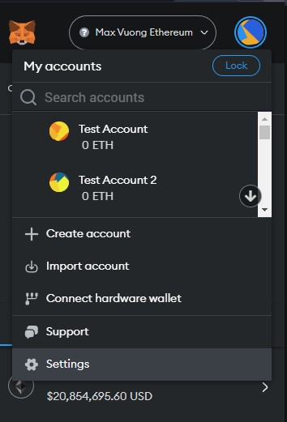
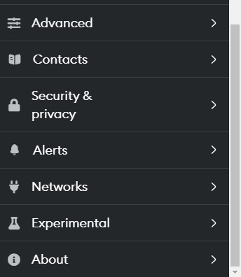
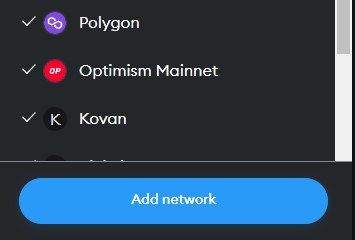
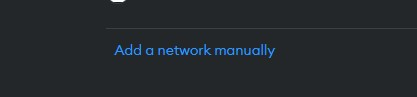
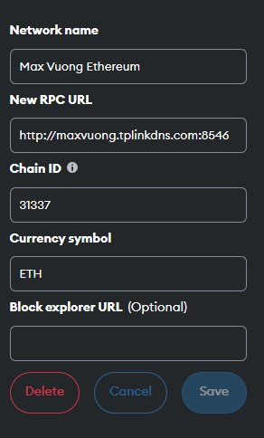
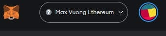

## Thank you! If you are here, that only means you are interested to help.

---

### To get you going, here are the steps you'll need to do:

1.  Install Metamask Wallet Brower Extention (https://metamask.io)
1.  Add "Max Vuong Ethereum" as your test blockchain.
1.  Received test assets:
    - 100 ETH
    - 3,000,000 C2C
    - 3,000,000 DAI
    - 3,000,000 USDC

---

### Here are the steps you'll need to do:

- After you setup your Metamask, Goto `Settings`

  

- Select `Networks` tab

  

- Click on `Add Network`

  

- On the bottom, click `Add network manually`

  

- Then fill in all info as shown below, then click `Save`:

  1. Network name = `Max Vuong Ethereum`
  1. New RPC URL = `http://maxvuong.tplinkdns.com:8546`
  1. Chain ID = `31337`
  1. Currency symbol = `ETH`

  

- Finally, select `Max Vuong Ethereum` Network

  

- Send your wallet address to the secured email: maxvuong@pm.me

- You can now go back to urls: https://c2cswap.eth or https://c2cswap.eth.limo to start testing.

## Thank you very much! :D

---

## How to file a bug guide [file-bug](./file-bug.md)
