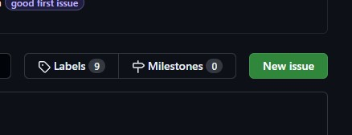
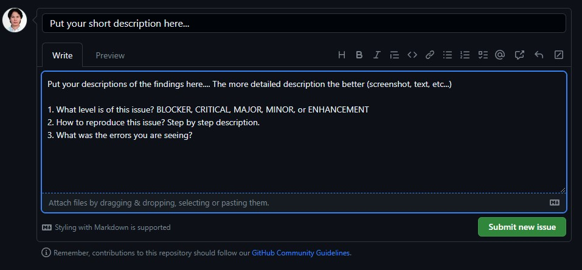

# How to file a bug for C2C Swap project

If you find an issue and would like to keep track of it, please go to this site

https://github.com/xuyenvuong/c2c-docs/issues

- Next click on `New issue` button

  

- Fill in your findings then click on `Submit new issue`

  1. What level is of this issue? `BLOCKER`, `CRITICAL`, `MAJOR`, `MINOR`, or `ENHANCEMENT`
  1. How to reproduce this issue? Step by step description.
  1. What was the errors you are seeing?

  

## Thank you!
